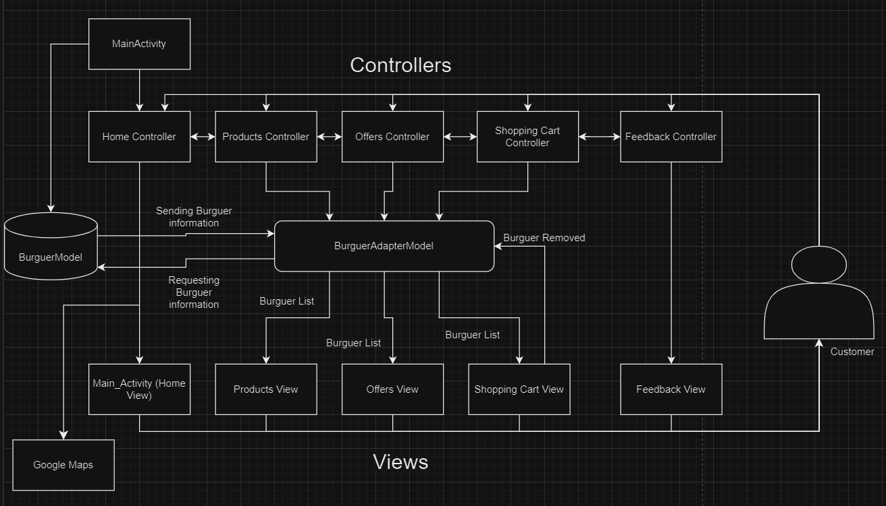

<h3>Controller Section</h3>

The controller section has been divided into six parts, as each controller works independently of the functionality of the layer. This makes future maintenance and scalability of the code easy as each code can be evaluated and modified independently.

Main Activity Controller: This controller will be responsible of instantiating all the burgers in the restaurant using the burger model and sending them to the adapter. In addition, an automatic intent has been implemented which will be made to update the Home Controller layer.

Home Controller: This controller will take care of the house logic. It also has a function so that when you click on the google image, it will make an intent to Google Maps. This Activity will show on the screen the Main_Acitivity View.

Product Controller: When the products button is pressed on the screen, this will trigger an intent from any section replacing the layer to the products area and will also receive the array of instantiated burgers. This controller will oversee displaying the Products View to show it to the customer and update the products through a hamburger adapter model which will provide a list of the selected hamburgers for products.

Offer Controller: Like the product controller, this Offers section has the same functionality, except that it uses the hamburger model adapter to load certain hamburgers from the array which will be implemented in the Offers View. In addition, this layer is also called by intents from any other layer.

Shopping Cart Controller: This layer will also have the same characteristics as the offers and products layer, using the adapter with an array of hamburgers selected by the customer. This layer will use the shopping cart view to show all the details to the customer, and it will also have the same buttons as the other layers with their intents to change what is shown on the screen. In addition, it will have methods to set the total price and a button to request the purchase.

Feedback Controller: This layer will have a form with validation to obtain a rating of the application by the customer collecting the first name, the last name, a comment, and his rating. It calls Feedback View in order to display it to customer on the screen. It will also have a toast to send a message to the customer if the feedback has been sent correctly or if something in the form is wrong.

<h3>Model Section</h3>

BurgerModel: This layer will take care of the hamburger class, plus it will have its getters and setters. Its constructor is ID, burgerName, burgerDescription, and burgerPrice.

BurgerAdapterModel: This layer will update the list of burgers, add each burger in the burger_model component and then adapt it to the section selected by the customer.

<h3>View Section</h3>

Main_activity: This view will display a header with the shopping cart icon, components such as the hamburger star, a button that makes an intent to google map, among others. It will also have four more buttons to control the other sections.

Product: This view will contain a list of the restaurant's products, buttons to move between sections and its header.

Offers: This view will contain a list of the burgers on offer, buttons to move between sections and your header.

Feedback: This view will contain a form where the customer can leave a review. The form has four inputs such as first name, last name, comment, a star rating container, a button to submit the form, buttons to move between sections and its header.

Shopping_card: This view will contain a list of the products chosen by the customer, a container where the total price of the order will be displayed and a button to request the order, buttons to move between sections and its header.

Burguer_model: This view will contain the components for each hamburger.
